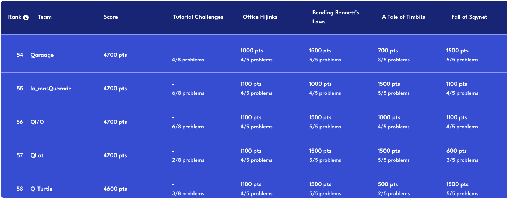

# QHack2023Challenges 

Our solutions to the [QHack2023](https://qhack.ai/) quantum computing challenges. The answers in files with "-AC" in their name are officially accepted solutions.

**Team** : $\mathbf{Q I / O}$

1. [Ezekiel Ekondu Emmanuelaudu](https://i-ex3c.github.io/Portfolio/)
2. [Harshit Gupta](https://github.com/TheGupta2012)
3. [Marcus Edwards](https://github.com/comp-phys-marc)
4. [Sairaaj Surve](https://github.com/SairaajSurve)

**Rank** : $\mathbf{56 / 793}$

